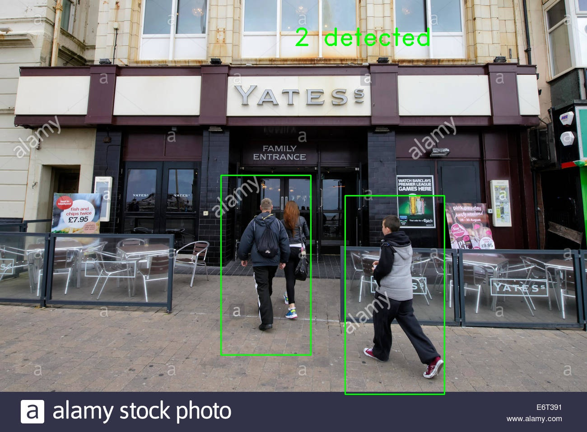

# Person Detection 

Person Detection using HOG as descriptor as Linear SVM as classifier using the OpenCV Library.

## Build Project

```
mkdir build
cd build 
cmake ..
make
```

## Run executable
```
./main <path to test_images>
```
After running the exectauble a log file `results.txt ` is generated in the build directory. the txt file contains timestamp, number of people detected in each image and the image file name. This information could be used to analyse how well the detector runs on N number of images.


## Results



